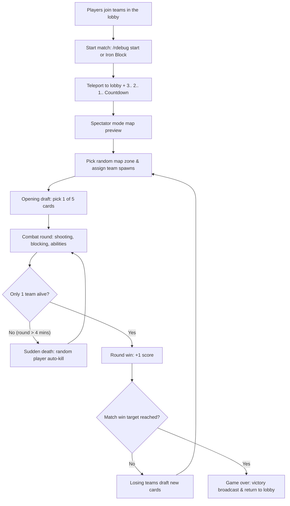

# RoundsPlugin

> **Language:** English · [Русский](readme.md)

A competitive **ROUNDS** mini-game plugin for Paper / Purpur Minecraft servers. Features 4 teams, an extensive card system with 111+ built-in cards and custom card support, up to 20+ rounds, special interactive physical blocks for quick arena setup, card draft compensation for losers, sudden death auto-elimination for prolonged rounds, freeplay mode, and complete TAB / PlaceholderAPI integration.


## Features

- **Team Combat (up to 4 teams):** Blue, Red, Yellow, and Green teams.
- **Special Weapon (The Gun):**
  - **LMB:** Fire bullets with calculated physics, spread, ricochets, and card effects.
  - **RMB:** Shield block (damage negation, triggers offensive and defensive card abilities).
  - **Q (Drop):** Manual magazine reload with a visual progress bar in the Action Bar.
- **Card System (111+ Cards):**
  - Bullet modifiers, damage multipliers, health scalers, speed bonuses, lifesteal, poison, frost, wall-piercing drill ammo, phantom summoning, explosions, homing bullets, and more.
  - 5 rarity tiers with configurable weights.
  - Multi-tier card variations (single card definition with different stats per rarity).
  - Comeback mechanics: losing teams draft new cards between rounds.
  - Interactive player card deck viewer (`/rdebug cards show`) with administrative card duplication and deletion.
  - Card selection rotation wheel (Wheel mode).
- **Physical Setup Blocks:** Interactive blocks for team selection, lobby center, map zones, spawn points, jump pads, and vertical lift columns.
- **Integrations:** Full [PlaceholderAPI](https://www.spigotmc.org/resources/placeholderapi.13006/) and [TAB](https://www.spigotmc.org/resources/tab.57806/) support, plus an optional built-in scoreboard.
- **Localization:** Complete UI and card localization powered by language packs (`lang/*.txt`).


## Requirements

- **Server:** Paper / Purpur 1.20.4+ (compatible with 1.20.x — 1.21.x)
- **Java:** Java 17 or newer
- **Optional:** [PlaceholderAPI](https://www.spigotmc.org/resources/placeholderapi.13006/)
- **Optional:** [TAB](https://www.spigotmc.org/resources/tab.57806/)


## Installation

1. Place `RoundsPlugin.jar` into your server's `plugins/` folder.
2. Restart the server (or load with PlugMan) to generate configuration files.
3. Configure `plugins/RoundsPlugin/config.yml` if desired.
4. Add or tweak cards in `plugins/RoundsPlugin/cards/custom/`.
5. Join the server as an administrator (`rounds.admin` permission or OP), run `/rdebug giveblocks`, and place the setup blocks in the world.


## Quick Setup & Arena Configuration

### 1. Getting the Setup Blocks

Run the following command:
```
/rdebug giveblocks
```
This gives you stacks of all special blocks and switches your game mode to **Creative**.

### 2. Special Blocks Reference

#### Team Selection Blocks (Lobby)
Stepping on these wool blocks joins the corresponding team before match start.

| Block | Item / Material | Purpose |
|-------|-----------------|---------|
| **Blue Team Entrance** | Light Blue Wool (`LIGHT_BLUE_WOOL`) | Join the Blue team |
| **Red Team Entrance** | Red Wool (`RED_WOOL`) | Join the Red team |
| **Yellow Team Entrance** | Yellow Wool (`YELLOW_WOOL`) | Join the Yellow team |
| **Green Team Entrance** | Lime Wool (`LIME_WOOL`) | Join the Green team |

#### Map, Lobby & Spawn Blocks

| Block | Item / Material | Purpose |
|-------|-----------------|---------|
| **Lobby Block** | Emerald Block (`EMERALD_BLOCK`) | Lobby center. Return point before/after matches. Only 1 active lobby block exists per world (placing a new one updates the location). Can also be set via `/rdebug setlobby`. |
| **50x50 Map Zone Block** | Diamond Block (`DIAMOND_BLOCK`) | Center of a 50x50 X/Z combat zone. |
| **100x100 Map Zone Block** | Emerald Block (`EMERALD_BLOCK`) | Center of a 100x100 X/Z combat zone. |
| **Spawn Block** | Obsidian (`OBSIDIAN`) | Team spawn point inside a map zone. |
| **Jump Block (Bounce Pad)** | Coal Block (`COAL_BLOCK`) | Stepping/landing on it deals % max HP damage and launches the player high into the air. |
| **Up Block (Lift Column)** | Purple Glazed Terracotta (`PURPLE_GLAZED_TERRACOTTA`) | Stepping on it smoothly lifts the player upwards for a set duration. |

#### Match Control Blocks

| Block | Item / Material | Purpose |
|-------|-----------------|---------|
| **Game Start Block** | Iron Block (`IRON_BLOCK`) | Starts the match when stepped on (admin or freeplay mode). |
| **Game End Block** | Redstone Block (`REDSTONE_BLOCK`) | Stops the match and resets state when stepped on. |

### 3. Step-by-Step Arena Setup

1. **Lobby:** Place a **Lobby Block** in your waiting area and place team wool blocks nearby.
2. **Map Zones:** Place one or more **Map Zone Blocks** (50x50 or 100x100) at the center of each combat arena. Each round, a random zone is selected.
3. **Team Spawns:** Inside each map zone, place **Spawn Blocks** (Obsidian) where teams will appear.
4. **Interactive Arena Elements (Optional):** Place jump or lift blocks manually, or fill selected regions using `/rdebug jumppos1` / `jumppos2` / `jumpset` and `/rdebug uppos1` / `uppos2` / `upset`.


## Gameplay Flow



1. **Team Selection:** Players step on their chosen team wool block.
2. **Match Start:** An admin runs `/rdebug start` or steps on the Iron Block.
3. **Countdown:** A 3-second countdown displays in chat while players preview the arena in spectator mode.
4. **Initial Card Draft:** All players open an inventory GUI offering 5 random cards.
5. **Round Combat:** Players receive their weapon, switch to survival mode, and engage in battle.
6. **Round End:** The last surviving team scores a round point.
7. **Comeback Draft:** Members of losing teams choose another card to upgrade their build.
8. **Victory:** The first team to reach the target win threshold (default 5) wins the match and everyone is returned to the lobby.

## Configuration (`config.yml`)

```yaml
# Language ID from plugins/RoundsPlugin/lang/ (without .txt extension)
language: EN_en

# Default player stats (reset every round)
defaults:
  damage: 3.0            # Base damage per bullet
  attack-speed: 20       # Attack cooldown in ticks (20 ticks = 1 sec; lower = faster)
  attack-speed-modifier: 0
  attack-range: 0
  ammo: 3                # Starting magazine ammo
  max-ammo: 3            # Maximum magazine capacity
  bullets: 1             # Number of bullets fired per shot (1 = single bullet, >1 = shotgun)
  hp: 20                 # Starting max health (supports up to 2048)
  bullet-speed: 1.0      # Bullet velocity multiplier
  reload-speed: 0        # Reload speed modifier (formula: 100 * (1 - reloadSpeed) ticks)

game:
  default-rounds: 5      # Default rounds needed to win the match
  max-rounds: 20         # Maximum configurable rounds
  card-selection-time: 200 # Time window for card selection (ticks)
  respawn-delay: 5

teams:
  enabled:
    - BLUE
    - RED
    - YELLOW
    - GREEN

gun:
  material: STICK        # Item material used for the weapon
  base-cooldown: 20      # Base shooting cooldown

cards:
  selection-count: 5     # Number of cards offered during selection
  weighted-rarity: true  # Use rarity weights during card generation

# Automatic world rule overrides during the game
game-rules:
  enabled: true
  instant-respawn: true       # Instant respawn without death screen
  keep-inventory: true        # Keep inventory on death
  freeze-time: true           # Freeze time at midday
  disable-weather: true       # Disable rain and thunderstorms
  disable-mob-spawning: true  # Disable natural mob spawns

# Colorize player names in tablist and nametags to match their team
color-nicknames: true

# Built-in scoreboard (recommended: use TAB + PlaceholderAPI instead)
builtin-scoreboard:
  enabled: false
  title: "&6&lROUNDS"

# Interactive block settings
jump-block:
  damage-percent: 20.0   # Percentage of max HP deducted upon bounce
  launch-height: 10.0    # Launch height in blocks

up-block:
  lift-speed: 0.3        # Vertical lift velocity
  duration-ticks: 40     # Duration in ticks (40 ticks = 2 sec)

# Freeplay mode (allows non-admins to start/stop games)
freeplay:
  enabled: false
```


## Card System

Cards are stored as standalone YAML files:
- `plugins/RoundsPlugin/cards/original/` — 111+ built-in cards.
- `plugins/RoundsPlugin/cards/custom/` — user-created custom cards.

### Standard Card Example (`burst.yml`)
```yaml
id: 8
name:
  ru: "&aОчередь"
  en: "&aBurst"
description:
  ru: "+2 пули, +3 патрона, -60% урона, +10% к времени перезарядки"
  en: "+2 Bullets, +3 Ammo, -60% DMG, +10% Reload time"
material: ARROW
enabled: true
variations:
  - rarity: COMMON
    effects:
      bullets: 2
      ammo: 3
      damage: -0.6
      reload: 1
```

### Card Variation Example (`combine.yml`)
```yaml
id: 13
name:
  ru: "&4Объединение"
  en: "&4Combine"
description:
  ru: "+{0} урона, -{1} патрона, +{2} к перезарядке"
  en: "+{0} DMG, -{1} Ammo, +{2} Reload time"
material: REDSTONE
enabled: true
variations:
  - rarity: COMMON
    values: ["50%", "1", "5%"]
    effects:
      damage: 0.5
      ammo: -1
      reload: 0.5
  - rarity: UNCOMMON
    values: ["75%", "2", "8%"]
    effects:
      damage: 0.75
      ammo: -2
      reload: 0.8
  - rarity: RARE
    values: ["100%", "2", "10%"]
    effects:
      damage: 1.0
      ammo: -2
      reload: 1.0
  - rarity: EPIC
    values: ["125%", "3", "13%"]
    effects:
      damage: 1.25
      ammo: -3
      reload: 1.3
```

### Card Effect Keys

| YAML Key | Description |
|----------|-------------|
| `damage` | Damage multiplier (+0.5 = +50% damage, -0.6 = -60%) |
| `attack-speed` | Attack rate modifier (changes shot cooldown) |
| `attack-speed-reload` / `reload` | Additional reload time penalty |
| `attack-range` | Extra attack range |
| `bullets` | Additional bullets fired per shot |
| `ammo` | Magazine capacity and current ammo |
| `bullet-speed` | Bullet flight velocity |
| `bounce` | Number of wall/surface ricochets |
| `target-bounce` | Ricochet tracking toward nearest enemy |
| `damage-per-bounce` | Bonus damage added per completed ricochet |
| `hp` | Max health multiplier (+0.5 = +50% HP) |
| `hp-cost` | Percentage of max HP consumed per shot |
| `cold` / `cold-level` | Slow/frost effect chance and intensity |
| `poison` / `poison-level` | Poison effect chance and intensity |
| `toxic-cloud` | Spawns a toxic lingering cloud on hit |
| `parazit` / `parazit-level` | Wither drain effect chance and level |
| `leech` | Lifesteal percentage from dealt damage |
| `homing` | Bullet homing tracking strength |
| `homing-on-block` | Grants homing bullets for N seconds after blocking |
| `empower` / `empower-charge` | Boosts the next shot's damage after blocking |
| `dark-strength` | Flat damage increase (+0.5 per stack) |
| `big-bullet` | Big Bullet: +70% hitbox/size, +30% reload time per stack |
| `bomb-bullet` | Spawns an explosion/bomb at bullet impact |
| `bomb-on-block` | Spawns explosive bombs around the player upon blocking |
| `explode-bullets` | Exploding AoE damage on bullet impact |
| `shield` | Shield cooldown baseline |
| `shield-charge` | Additional shield block charges |
| `double-block` | Double block charge capacity |
| `shields-up` | Automatically activates shield when ammo reaches 0 |
| `block-cd` / `shield-cooldown` | Shield block cooldown modifier |
| `reload-speed` | Reload speed bonus (up to 0.95) |
| `tactical-reload` | Instantly reloads the gun upon shield block |
| `auto-reload` | Passive automatic ammunition regeneration over time |
| `truster` / `truster-lvl` | Increased bullet knockback strength |
| `jump-height` | Player jump height modifier |
| `grow` | Increases max HP and character model scale |
| `speed` / `speed-boost` | Movement speed modifier |
| `stun` | Stuns target on hit |
| `heal` | Periodic health regeneration |
| `saw` | Saw: spinning flame damage ring around the player on block |
| `shockwave` | Shockwave: strong knockback wave on block |
| `implode` | Pulls nearby enemies toward player on block |
| `silence` | Silence: disables enemy shooting and blocking on block |
| `silence-aura` | Persistent silence aura around the player |
| `sneaky` | Invisibility and stealth effects |
| `emp` | EMP: heavy slowness applied to nearby enemies on block |
| `overpower` | Overpower: deals % of current HP to nearby enemies on block |
| `refresh` | Resets shield cooldown and refills magazine |
| `radiance` / `highlight` | Highlights enemy silhouettes with glowing outline |
| `lifesteal-aura` | Drains health from nearby enemies over time |
| `phoenix` | Phoenix: revives player from lethal damage once per round |
| `abyssal` | Abyssal: summons a phantom ally when standing still for 10s |
| `drill` | Drill Ammo: bullets pierce through walls and solid blocks |
| `teleport` | Teleports player forward in facing direction upon blocking |
| `ammo-per-hit` | Restores ammo upon hitting an enemy |
| `hp-boost-on-hit` | Increases max health upon hitting an enemy |
| `pristine-perseverance` | Max HP bonus when at full health |
| `blood-furry` | Blood Fury: stat boost rage upon taking damage |
| `executioner` | Executioner: extra execute damage against low HP targets |
| `storm-caller` | Strikes lightning at target upon hit |
| `evasion` | Dodge chance against incoming hits |
| `chameleon` | Chameleon invisibility when standing still |
| `snowball` | Snowball: stacking bonuses for consecutive round wins |
| `skyfall` | Skyfall: AoE impact upon landing from heights (negates fall damage) |
| `berserk` | Increases stats as health decreases |
| `overheat` | Allows shooting beyond empty magazine by consuming HP |
| `second-wind` | Second Wind: survives lethal blow with 1 HP and invulnerability |
| `spikes` | Reflects damage back to attacker |
| `bullet-rain` | Bullet rain bonus projectiles and extra ammo capacity |
| `frost-armor` | Frost Armor: slows attackers |
| `no-party` | Disables blocking and reloading for nearby enemies |

### Card Rarities and Weights

| Rarity | Color | Base Drop Weight |
|--------|-------|------------------|
| **COMMON** | White (`&f`) | 40 |
| **UNCOMMON** | Green (`&a`) | 30 |
| **RARE** | Aqua (`&b`) | 18 |
| **EPIC** | Light Purple (`&d`) | 9 |
| **LEGENDARY** | Gold (`&6`) | 3 |


## Commands & Permissions

Base command: `/rdebug`.

### Public Commands (All Players)

| Command | Description |
|---------|-------------|
| `/rdebug join` | Join an ongoing match (assigned to smallest team or restored from saved session) |
| `/rdebug info` | Display plugin version, game state, team scores, and loaded card count |
| `/rdebug stats [player]` | View your own stats or inspect another player's stats |
| `/rdebug cards show [player] [page]` | Open an interactive GUI showing all cards owned by a player |

### Freeplay Mode (`freeplay: true`)

When freeplay is enabled (`/rdebug freeplay on`), regular players without admin permissions can execute safe commands:
- `/rdebug start` — start match
- `/rdebug stop` — stop match
- `/rdebug rounds <n>` — set rounds to win
- `/rdebug givegun` — obtain weapon
- `/rdebug wheel on|off` — toggle card wheel rotation

### Admin Commands (`rounds.admin`)

| Command | Arguments | Description |
|---------|-----------|-------------|
| `/rdebug help` | | Displays full formatted command help |
| `/rdebug start` | | Starts the match (countdown → preview → draft → round) |
| `/rdebug stop` | | Force-stops the game and teleports players to lobby |
| `/rdebug status` | | Shows current round, match state, and team scores |
| `/rdebug rounds <number>` | `<1..N>` | Sets the number of round wins required for victory |
| `/rdebug autodeath <on\|off>` | `on/off` | Toggles automatic elimination of a random player in long rounds (>4 min) |
| `/rdebug freeplay <on\|off>` | `on/off` | Toggles non-admin access to safe commands |
| `/rdebug giveblocks [player]` | `[player]` | Gives all setup blocks and switches player to Creative mode |
| `/rdebug setlobby` | | Sets the lobby block location to player's current position |
| `/rdebug jumppos1` / `jumppos2` | | Sets corner 1 and 2 for the jump pad selection |
| `/rdebug jumpset` | | Fills selected region with Jump Blocks (`COAL_BLOCK`) |
| `/rdebug uppos1` / `uppos2` | | Sets corner 1 and 2 for the vertical lift selection |
| `/rdebug upset` | | Fills selected region with Up Blocks (`PURPLE_GLAZED_TERRACOTTA`) |
| `/rdebug cards` | | Opens a test card selection GUI |
| `/rdebug cards reload` | | Reloads card files from `cards/original` and `cards/custom` |
| `/rdebug cards add [player] <name\|id>` | `[player] <card>` | Grants a specific card to a player |
| `/rdebug wheel <on\|off>` | `on/off` | Toggles automatic card rerolling every 6 seconds during draft |
| `/rdebug givegun [player\|@a]` | `[player\|@a]` | Gives a gun to self, specified player, or all players |
| `/rdebug tab <on\|off>` | `on/off` | Toggles built-in scoreboard display |
| `/rdebug tab name <title>` | `<title>` | Sets built-in scoreboard title |
| `/rdebug stats <player> <stat> <value>` | `<player> <stat> <val>` | Modifies a player's stat value |
| `/rdebug setstat <stat> <value> [player]` | `<stat> <val> [player]` | Sets a stat value directly |
| `/rdebug setteam <COLOR> [player]` | `<BLUE\|RED\|YELLOW\|GREEN>` | Assigns a player to a team |
| `/rdebug setlanguage <lang>` | `<RU_ru\|EN_en...>` | Changes plugin language dynamically |
| `/rdebug effect <type> <amp> <dur>` | `<type> <amp> <dur>` | Applies a potion effect |
| `/rdebug heal [amount]` | `[HP]` | Heals player to maximum health |
| `/rdebug resetstats` | | Clears stats, cards, and inventory |
| `/rdebug reload` | | Fully reloads `config.yml`, cards, and language packs |
| `/rdebug placeholders` | | Displays list of PlaceholderAPI placeholders |

### Permissions

| Permission | Description | Default |
|------------|-------------|---------|
| `rounds.admin` | Full access to `/rdebug` commands and match management | `op` |
| `rounds.join` | Ability to join teams via wool blocks and `/rdebug join` | `true` (everyone) |


## Placeholders (PlaceholderAPI)

Expansion identifier: `%rounds_...%`

### Match Placeholders

| Placeholder | Description |
|-------------|-------------|
| `%rounds_round%` | Current round number |
| `%rounds_rounds_to_win%` | Wins required for victory |
| `%rounds_round_display%` | Formatted round progress (e.g. `3/5`) |
| `%rounds_state%` | Current game state (`WAITING`, `CARDS`, `PLAYING`, `ROUND_END`, `GAME_END`) |
| `%rounds_team%` | Player's team name |
| `%rounds_team_color%` | Team color code (`§9`, `§c`, `§e`, `§a`) |
| `%rounds_team_adjective%` | Team adjective form (blue, red, etc.) |
| `%rounds_team_wins%` | Player's team win count |
| `%rounds_blue_wins%` | Blue team wins |
| `%rounds_red_wins%` | Red team wins |
| `%rounds_yellow_wins%` | Yellow team wins |
| `%rounds_green_wins%` | Green team wins |
| `%rounds_blue_name%` | Localized Blue team name |
| `%rounds_red_name%` | Localized Red team name |
| `%rounds_yellow_name%` | Localized Yellow team name |
| `%rounds_green_name%` | Localized Green team name |

### Player Stat Placeholders

| Placeholder | Description |
|-------------|-------------|
| `%rounds_stat_hp%` | Max health |
| `%rounds_stat_dmg%` | Bullet damage |
| `%rounds_stat_atk_speed%` | Attack speed modifier |
| `%rounds_stat_atkr%` | Attack radius |
| `%rounds_stat_ammo%` | Current ammo |
| `%rounds_stat_max_ammo%` | Max magazine capacity |
| `%rounds_stat_bullets%` | Bullets per shot |
| `%rounds_stat_bullet_speed%` | Bullet flight velocity |
| `%rounds_stat_reload_time%` | Reload time in seconds |
| `%rounds_stat_bounce%` | Ricochet count |
| `%rounds_stat_homing%` | Homing strength |
| `%rounds_stat_big_bullet%` | Big bullet level |
| `%rounds_stat_cold%` / `%rounds_stat_cold_lvl%` | Cold chance and level |
| `%rounds_stat_poison%` / `%rounds_stat_poison_lvl%` | Poison chance and level |
| `%rounds_stat_parazit%` / `%rounds_stat_parazit_lvl%` | Wither drain chance and level |
| `%rounds_stat_leech%` | Lifesteal |
| `%rounds_stat_truster%` | Knockback strength |
| `%rounds_stat_jump_height%` | Jump height modifier |
| `%rounds_stat_empower%` / `%rounds_stat_empower_charge%` | Empower boost and charges |
| `%rounds_stat_dark_strength%` / `%rounds_stat_dark%` | Dark energy stats |
| `%rounds_stat_grow%` | Growth level |
| `%rounds_stat_bomb_bullet%` | Bomb bullets |
| `%rounds_stat_bomb_on_block%` | Bombs on block |
| `%rounds_stat_shield_active%` | Shield active state (`1` or `0`) |
| `%rounds_stat_shield_hp%` | Shield health |
| `%rounds_stat_shield_cd%` | Shield cooldown |
| `%rounds_stat_speed%` | Movement speed |
| `%rounds_stat_stun%` | Stun duration |
| `%rounds_stat_saw%` | Saw level |
| `%rounds_stat_silence%` | Silence duration |
| `%rounds_stat_emp%` | EMP strength |
| `%rounds_stat_sneaky%` | Sneaky stealth level |
| `%rounds_stat_phoenix%` | Phoenix revive charges |
| `%rounds_stat_abyssal%` | Abyssal phantom level |
| `%rounds_stat_cards%` | Total collected cards |


## Localization

Language files reside in `plugins/RoundsPlugin/lang/`:
- Each `<LanguageID>.txt` file represents a distinct language (e.g. `RU_ru.txt`, `EN_en.txt`).
- The filename without `.txt` serves as the language identifier.

### Changing Language
1. In game: `/rdebug setlanguage <lang>` (features tab-completion for all available languages).
2. Or update `language: EN_en` in `config.yml`.

### Adding a Custom Translation
1. Copy `plugins/RoundsPlugin/lang/EN_en.txt` to `ES_es.txt`.
2. Translate the string values.
3. Run `/rdebug reload` — the new language will be registered immediately.


## File Structure

| File Path | Description |
|-----------|-------------|
| `plugins/RoundsPlugin/config.yml` | Main plugin configuration |
| `plugins/RoundsPlugin/lang/*.txt` | Language packs |
| `plugins/RoundsPlugin/cards/original/*.yml` | Built-in standard cards (111+ files) |
| `plugins/RoundsPlugin/cards/custom/*.yml` | User-created custom cards |
| `plugins/RoundsPlugin/playerdata/` | Saved player data (stats, cards) |
| `plugins/RoundsPlugin/game-state.yml` | Saved active match state (restores on restart) |
| `plugins/RoundsPlugin/active-players.yml` | Active participant list for current session |
| `<World>/rounds-blocks.yml` | Saved positions of team join, start, stop, jump, and lift blocks |
| `<World>/rounds-map-blocks.yml` | Saved positions of lobby, map zone centers, and spawn points |


## Building from Source

Requirements: **Java 17** and **Gradle 8.9+**:

```bash
./gradlew clean build
```

The output artifact is generated at: `build/libs/RoundsPlugin-1.X.jar`.
