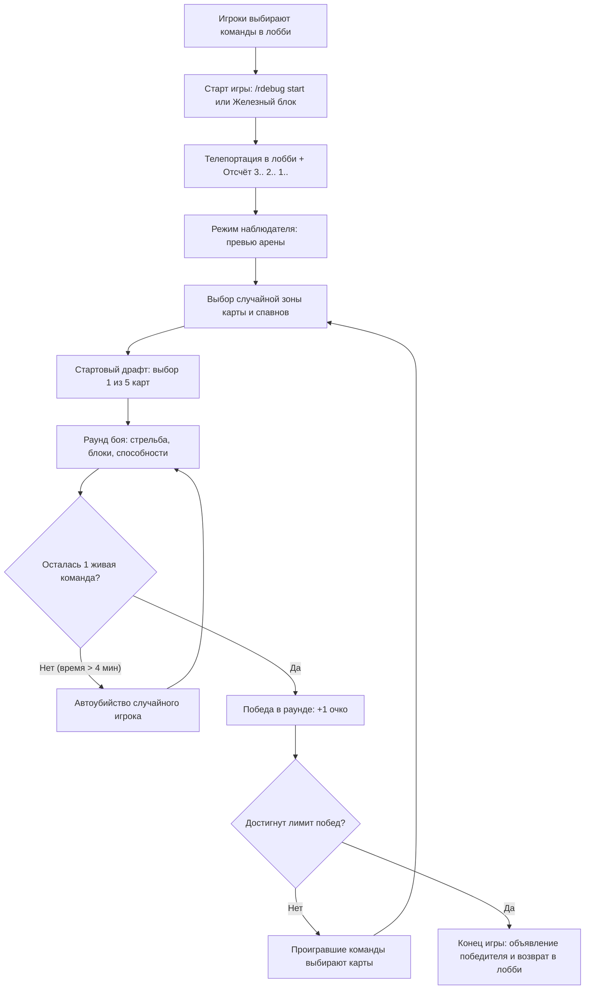

# RoundsPlugin

> **Язык:** Русский · [English](readme.en.md)

Minecraft плагин соревновательной мини-игры **ROUNDS** для серверов Paper / Purpur. 4 команды, глубокая карточная система с 111+ готовыми картами и возможностью создания своих, до 20+ раундов, система физических интерактивных блоков для быстрой настройки карт, механика выбора карт для проигравших, автоубийство при затяжных раундах, режим фриплея и поддержка TAB / PlaceholderAPI.


## Возможности

- **Командный бой (до 4 команд):** Синие, Красные, Жёлтые и Зелёные команды.
- **Особое оружие (Пушка):**
  - **ЛКМ:** Стрельба пулями с расчётом физики, разброса, рикошетов и эффектов.
  - **ПКМ:** Блокировка щитом (отражение урона, активация защитных и атакующих карточных эффектов).
  - **Q (Выброс):** Ручная перезарядка обоймы с визуальным прогресс-баром в Action Bar.
- **Карточная система (111+ карт):**
  - Модификаторы пуль, урона, здоровья, скорости, вампиризма, яда, заморозки, бурения сквозь блоки, призыва фантомов, взрывов, цепных рикошетов и многого другого.
  - 5 уровней редкости с настраиваемыми весами.
  - Поддержка вариативности (одна карта — разные значения и эффекты в зависимости от редкости).
  - Карточная компенсация: игроки проигравшей команды получают выбор новой карты между раундами.
  - Интерактивный GUI инвентаря карт для игроков (`/rdebug cards show`) и управление картами для администраторов.
  - Ротация карт при выборе (колесо карт / Wheel).
- **Быстрая настройка через блоки:** Специальные интерактивные блоки входа в команды, лобби, зон карт, спавнов, батутов и зон подъёма.
- **Интеграция:** Полная совместимость с [PlaceholderAPI](https://www.spigotmc.org/resources/placeholderapi.13006/) и [TAB](https://www.spigotmc.org/resources/tab.57806/), а также встроенный скорборд.
- **Мультиязычность:** Полная локализация интерфейса и карт через систему языковых пакетов (`lang/*.txt`).


## Системные требования

- **Сервер:** Paper / Purpur 1.20.4+ (совместимо с 1.20.x — 1.21.x)
- **Java:** Java 17 или новее
- **Опционально:** [PlaceholderAPI](https://www.spigotmc.org/resources/placeholderapi.13006/)
- **Опционально:** [TAB](https://www.spigotmc.org/resources/tab.57806/)


## Установка

1. Поместите скомпилированный файл `RoundsPlugin.jar` в папку `plugins/` вашего сервера.
2. Перезапустите сервер (или используйте PlugMan / перезагрузку) для генерации файлов конфигурации.
3. При необходимости настройте `plugins/RoundsPlugin/config.yml`.
4. Настройте или добавьте свои карты в `plugins/RoundsPlugin/cards/custom/`.
5. Войдите на сервер с правами администратора (`rounds.admin` или OP), выполните `/rdebug giveblocks` и расставьте интерактивные блоки в мире.


## Быстрый старт и настройка арены

### 1. Получение блоков настройки

Выполните команду:
```
/rdebug giveblocks
```
Вам будут выданы стаки всех специальных блоков, а режим игры автоматически переключится в **Творческий (Creative)**.

### 2. Таблица специальных блоков

#### Блоки выбора команды (Лобби)
Игроки наступают на соответствующий блок шерсти в лобби, чтобы вступить в команду.

| Блок | Предмет / Материал | Назначение |
|------|--------------------|------------|
| **Вход за Синюю команду** | Светло-синяя шерсть (`LIGHT_BLUE_WOOL`) | Вступление в синюю команду |
| **Вход за Красную команду** | Красная шерсть (`RED_WOOL`) | Вступление в красную команду |
| **Вход за Жёлтую команду** | Жёлтая шерсть (`YELLOW_WOOL`) | Вступление в жёлтую команду |
| **Вход за Зелёную команду** | Лаймовая шерсть (`LIME_WOOL`) | Вступление в зелёную команду |

#### Блоки карты, лобби и спавнов

| Блок | Предмет / Материал | Назначение |
|------|--------------------|------------|
| **Блок лобби** | Изумрудный блок (`EMERALD_BLOCK`) | Центр лобби. Точка возврата игроков до/после матча. На карте может быть только 1 активный блок лобби (установка нового перемещает точку). Также можно задать через `/rdebug setlobby`. |
| **Блок зоны карты 50x50** | Алмазный блок (`DIAMOND_BLOCK`) | Центр игровой зоны размером 50x50 блоков по X/Z. |
| **Блок зоны карты 100x100** | Изумрудный блок (`EMERALD_BLOCK`) | Центр игровой зоны размером 100x100 блоков по X/Z. |
| **Блок спавна** | Обсидиан (`OBSIDIAN`) | Точка появления команды внутри зоны карты. |
| **Блок прыжка (Батут)** | Угольный блок (`COAL_BLOCK`) | При падении/наступании отнимает % здоровья и подбрасывает игрока высоко вверх. |
| **Блок подъёма (Лифт)** | Пурпурная глазурованная керамика (`PURPLE_GLAZED_TERRACOTTA`) | При наступании плавно поднимает игрока вверх в течение заданного времени. |

#### Блоки управления игрой

| Блок | Предмет / Материал | Назначение |
|------|--------------------|------------|
| **Блок старта игры** | Железный блок (`IRON_BLOCK`) | Запуск матча при наступании (для администраторов или всех при включённом фриплее). |
| **Блок завершения игры** | Блок красного камня (`REDSTONE_BLOCK`) | Принудительная остановка матча и сброс состояния. |

### 3. Пошаговая настройка арены

1. **Лобби:** Поставьте **Блок лобби** в зоне ожидания и разместите блоки шерсти для выбора команд.
2. **Зоны карты:** Поставьте один или несколько **Блоков карты** (50x50 или 100x100) в центрах игровых локаций. В каждом раунде плагин выбирает случайную зону.
3. **Спавны команд:** Внутри радиуса каждой зоны карты поставьте **Блоки спавна** (обсидиан) — точки, где будут появляться команды в начале раунда.
4. **Интерактивные элементы (по желанию):** Разместите блоки прыжка или зоны подъёма вручную либо выделите область командами `/rdebug jumppos1` / `jumppos2` / `jumpset` и `/rdebug uppos1` / `uppos2` / `upset`.


## Игровой процесс



1. **Подготовка:** Игроки встают на шерсть своей команды.
2. **Запуск:** Администратор вводит `/rdebug start` или наступает на Железный блок.
3. **Отсчёт:** Запускается 3-секундный таймер в чате. Игроки переходят в режим наблюдателя для осмотра локации.
4. **Стартовый выбор карт:** Игрокам открывается меню из 5 случайных карт.
5. **Бой:** Игроки получают пушку, переходят в режим выживания и сражаются на выбранной арене.
6. **Завершение раунда:** Команда последнего выжившего получает очко раунда.
7. **Фаза улучшения:** Игроки проигравших команд получают новое меню выбора карт для усиления перед следующим раундом.
8. **Победа в матче:** Первая команда, набравшая установленное количество побед (по умолчанию 5), побеждает в матче, после чего все возвращаются в лобби.


## Конфигурация (`config.yml`)

```yaml
# Языковой пакет из папки plugins/RoundsPlugin/lang/ (без расширения .txt)
language: RU_ru

# Базовые характеристики игроков (сбрасываются каждый раунд)
defaults:
  damage: 3.0            # Базовый урон за пулю
  attack-speed: 20       # Кулдаун между выстрелами в тиках (20 тиков = 1 сек, меньше = быстрее)
  attack-speed-modifier: 0
  attack-range: 0
  ammo: 3                # Начальное количество патронов в обойме
  max-ammo: 3            # Максимальный размер обоймы
  bullets: 1             # Количество пуль за один выстрел (1 = обычный выстрел, >1 = дробовик)
  hp: 20                 # Начальный запас здоровья (максимум до 2048)
  bullet-speed: 1.0      # Множитель скорости полёта пуль
  reload-speed: 0        # Бонус скорости перезарядки (формула: 100 * (1 - reloadSpeed) тиков)

game:
  default-rounds: 5      # Количество побед для общего выигрыша по умолчанию
  max-rounds: 20         # Максимально допустимое число раундов
  card-selection-time: 200 # Время на выбор карт (в тиках)
  respawn-delay: 5

teams:
  enabled:
    - BLUE
    - RED
    - YELLOW
    - GREEN

gun:
  material: STICK        # Материал предмета пушки в инвентаре
  base-cooldown: 20      # Базовый кулдаун выстрела

cards:
  selection-count: 5     # Количество карт, предлагаемых на выбор
  weighted-rarity: true  # Учёт весов редкости при генерации карт

# Автоматическое управление игровыми правилами мира во время игры
game-rules:
  enabled: true
  instant-respawn: true       # Мгновенный респавн без экрана смерти
  keep-inventory: true        # Сохранение инвентаря
  freeze-time: true           # Фиксация дневного времени
  disable-weather: true       # Отключение дождя и грозы
  disable-mob-spawning: true  # Отключение спавна мобов

# Окрашивание ников игроков в табе и над головой в цвет команды
color-nicknames: true

# Встроенный Scoreboard (рекомендуется использовать связку TAB + PlaceholderAPI)
builtin-scoreboard:
  enabled: false
  title: "&6&lROUNDS"

# Настройки интерактивных блоков
jump-block:
  damage-percent: 20.0   # Процент от максимального HP, отнимаемый при прыжке (20 = 20%)
  launch-height: 10.0    # Высота подбрасывания в блоках

up-block:
  lift-speed: 0.3        # Скорость вертикального подъёма
  duration-ticks: 40     # Длительность подъёма в тиках (40 тиков = 2 сек)

# Разрешить обычным игрокам без прав OP/admin запускать безопасные команды
freeplay:
  enabled: false
```


## Карточная система

Карты хранятся в формате отдельных YAML-файлов:
- `plugins/RoundsPlugin/cards/original/` — стандартные встроенные карты (111+ файлов).
- `plugins/RoundsPlugin/cards/custom/` — пользовательские карты.

### Пример обычной карты (`burst.yml`)
```yaml
id: 8
name:
  ru: "&aОчередь"
  en: "&aBurst"
description:
  ru: "+2 пули, +3 патрона, -60% урона, +10% к времени перезарядки"
  en: "+2 Bullets, +3 Ammo, -60% DMG, +10% Reload time"
material: ARROW
enabled: true
variations:
  - rarity: COMMON
    effects:
      bullets: 2
      ammo: 3
      damage: -0.6
      reload: 1
```

### Пример карты с вариативностью (`combine.yml`)
```yaml
id: 13
name:
  ru: "&4Объединение"
  en: "&4Combine"
description:
  ru: "+{0} урона, -{1} патрона, +{2} к перезарядке"
  en: "+{0} DMG, -{1} Ammo, +{2} Reload time"
material: REDSTONE
enabled: true
variations:
  - rarity: COMMON
    values: ["50%", "1", "5%"]
    effects:
      damage: 0.5
      ammo: -1
      reload: 0.5
  - rarity: UNCOMMON
    values: ["75%", "2", "8%"]
    effects:
      damage: 0.75
      ammo: -2
      reload: 0.8
  - rarity: RARE
    values: ["100%", "2", "10%"]
    effects:
      damage: 1.0
      ammo: -2
      reload: 1.0
  - rarity: EPIC
    values: ["125%", "3", "13%"]
    effects:
      damage: 1.25
      ammo: -3
      reload: 1.3
```

### Ключи эффектов карт

| Ключ в YAML | Описание эффекта |
|-------------|------------------|
| `damage` | Множитель урона (+0.5 = +50% урона, -0.6 = -60%) |
| `attack-speed` | Скорость атаки (изменяет кулдаун между выстрелами) |
| `attack-speed-reload` / `reload` | Дополнительная задержка перезарядки |
| `attack-range` | Дополнительный радиус атаки |
| `bullets` | Количество дополнительных пуль за выстрел |
| `ammo` | Количество патронов в обойме и макс. вместимость |
| `bullet-speed` | Скорость полёта пуль |
| `bounce` | Количество рикошетов пули от стен и блоков |
| `target-bounce` | Рикошет пули в ближайшего врага |
| `damage-per-bounce` | Бонусный урон за каждый совершенный рикошет |
| `hp` | Множитель максимального здоровья (+0.5 = +50% HP) |
| `hp-cost` | Расход % от макс. здоровья при каждом выстреле |
| `cold` / `cold-level` | Шанс и уровень эффекта замедления/обморожения цели |
| `poison` / `poison-level` | Шанс и уровень отравления |
| `toxic-cloud` | Появление ядовитого облака при попадании |
| `parazit` / `parazit-level` | Шанс и уровень наложения эффекта иссушения |
| `leech` | Вампиризм (лечение стрелка на % от нанесённого урона) |
| `homing` | Сила самонаведения пуль на противников |
| `homing-on-block` | Самонаведение пуль на N секунд после блокировки щитом |
| `empower` / `empower-charge` | Усиление урона следующего выстрела после блока |
| `dark-strength` | Постоянный бонус к урону (+0.5 урона за стак) |
| `big-bullet` | Большая пуля: +70% к размеру хитбокса попадания, +30% к времени перезарядки |
| `bomb-bullet` | Спавн взрыва/бомбы в точке попадания пули |
| `bomb-on-block` | Спавн бомб вокруг игрока при активации щита |
| `explode-bullets` | Взрывной AoE-урон вокруг места попадания |
| `shield` | Наличие и базовые параметры щита |
| `shield-charge` | Дополнительные заряды щита (парирования) |
| `double-block` | Двойной заряд блокировки |
| `shields-up` | Автоматическая активация щита при опустошении обоймы |
| `block-cd` / `shield-cooldown` | Изменение кулдауна блокировки щитом |
| `reload-speed` | Бонус к скорости перезарядки (до 0.95) |
| `tactical-reload` | Мгновенная перезарядка оружия при блокировке щитом |
| `auto-reload` | Пассивная автоперезарядка патронов со временем |
| `truster` / `truster-lvl` | Увеличенная сила отбрасывания врагов пулями |
| `jump-height` | Увеличение высоты прыжка игрока |
| `grow` | Увеличение запаса здоровья и физического размера модели |
| `speed` / `speed-boost` | Скорость перемещения игрока |
| `stun` | Оглушение противника при попадании |
| `heal` | Периодическая регенерация здоровья |
| `saw` | Пила: огненное кольцо урона вокруг игрока при блоке |
| `shockwave` | Ударная волна: сильное отбрасывание врагов вокруг при блоке |
| `implode` | Притягивание врагов к игроку при активации блока |
| `silence` | Безмолвие: запрет стрельбы и щита врагам вокруг на время |
| `silence-aura` | Постоянная аура безмолвия вокруг игрока |
| `sneaky` | Скрытность / незаметность |
| `emp` | ЭМП: сильное замедление врагов вокруг при блоке |
| `overpower` | Сокрушение: урон врагам вокруг в % от текущего HP при блоке |
| `refresh` | Сброс кулдауна щита и мгновенное пополнение патронов |
| `radiance` / `highlight` | Подсветка силуэтов врагов эффектом свечения |
| `lifesteal-aura` | Аура высасывания здоровья у врагов поблизости |
| `phoenix` | Феникс: автоматическое воскрешение при получении смертельного урона |
| `abyssal` | Бездна: призыв фантома-помощника, если стоять неподвижно 10 секунд |
| `drill` | Буровые пули: пробивают стены и летят сквозь препятствия |
| `teleport` | Телепортация вперёд в направлении взгляда при блокировке |
| `ammo-per-hit` | Восстановление патронов при успешном попадании |
| `hp-boost-on-hit` | Увеличение макс. запаса HP при попадании |
| `pristine-perseverance` | Бонус к здоровью при полном запасе HP |
| `blood-furry` | Ярость: бафф характеристик при получении урона |
| `executioner` | Палач: добивающий урон по целям с низким HP |
| `storm-caller` | Призыв молний при попадании |
| `evasion` | Шанс уклонения от входящего урона |
| `chameleon` | Невидимость при неподвижности |
| `snowball` | Эффект снежка: накапливаемые бонусы за серии побед |
| `skyfall` | Удар по площади при приземлении с высоты без урона от падения |
| `berserk` | Увеличение параметров по мере снижения здоровья |
| `overheat` | Перегрев: стрельба без патронов за счёт собственного здоровья |
| `second-wind` | Второе дыхание: спасение от смерти с 1 HP и неуязвимостью |
| `spikes` | Шипы: возврат урона атакующему |
| `bullet-rain` | Дождь пуль и расширение обоймы |
| `frost-armor` | Ледяная броня: замедление атакующих врагов |
| `no-party` | Блокировка щита и перезарядки ближайшим противникам |

### Редкости карт и шансы

| Редкость | Цвет | Базовый вес выпадения |
|----------|------|------------------------|
| **COMMON** | Белый (`&f`) | 40 |
| **UNCOMMON** | Зелёный (`&a`) | 30 |
| **RARE** | Голубой (`&b`) | 18 |
| **EPIC** | Светло-фиолетовый (`&d`) | 9 |
| **LEGENDARY** | Золотой (`&6`) | 3 |


## Команды и права

Главная команда плагина — `/rdebug`.

### Общедоступные команды (для всех игроков)

| Команда | Описание |
|---------|----------|
| `/rdebug join` | Присоединиться к идущему матчу (вход в наименьшую команду либо восстановление сохранённой сессии) |
| `/rdebug info` | Информация о плагине, текущем состоянии матча, командах и загруженных картах |
| `/rdebug stats [игрок]` | Посмотреть свои характеристики или статистику другого игрока |
| `/rdebug cards show [игрок] [страница]` | Открыть просмотр полученных карт игрока |

### Режим фриплея (`freeplay: true`)

При включении фриплея (`/rdebug freeplay on`) обычные игроки без прав администратора получают доступ к безопасным командам:
- `/rdebug start` — запуск игры
- `/rdebug stop` — остановка игры
- `/rdebug rounds <n>` — выбор количества раундов
- `/rdebug givegun` — получение оружия
- `/rdebug wheel on|off` — переключение ротации карт

### Команды администратора (`rounds.admin`)

| Команда | Параметры | Описание |
|---------|-----------|----------|
| `/rdebug help` | | Вывод структурированной справки по всем командам |
| `/rdebug start` | | Запустить матч (отсчёт → превью → выбор карт → раунд) |
| `/rdebug stop` | | Принудительно остановить игру и вернуть всех в лобби |
| `/rdebug status` | | Показать текущий раунд, статус матча и счёт команд |
| `/rdebug rounds <число>` | `<1..N>` | Установить количество побед для выигрыша |
| `/rdebug autodeath <on\|off>` | `on/off` | Включить/выключить автоубийство случайного игрока при затяжных раундах (>4 мин) |
| `/rdebug freeplay <on\|off>` | `on/off` | Включить/выключить доступ к базовым командам для игроков |
| `/rdebug giveblocks [игрок]` | `[игрок]` | Выдать стак всех специальных блоков и включить режим Creative |
| `/rdebug setlobby` | | Установить точку лобби на текущую позицию игрока |
| `/rdebug jumppos1` / `jumppos2` | | Установить 1-ю и 2-ю точки для зоны прыжка |
| `/rdebug jumpset` | | Заполнить выделенную область блоками прыжка (`COAL_BLOCK`) |
| `/rdebug uppos1` / `uppos2` | | Установить 1-ю и 2-ю точки для зоны подъёма |
| `/rdebug upset` | | Заполнить выделенную область блоками подъёма (`PURPLE_GLAZED_TERRACOTTA`) |
| `/rdebug cards` | | Открыть тестовое меню выбора из 5 карт |
| `/rdebug cards reload` | | Перезагрузить файлы карт из `cards/original` и `cards/custom` |
| `/rdebug cards add [игрок] <название\|id>` | `[игрок] <карта>` | Выдать конкретную карту игроку по её названию или ID |
| `/rdebug wheel <on\|off>` | `on/off` | Включить/выключить авторотацию карт каждые 6 сек во время выбора |
| `/rdebug givegun [игрок\|@a]` | `[игрок\|@a]` | Выдать пушку себе, указанному игроку или всем игрокам |
| `/rdebug tab <on\|off>` | `on/off` | Включить/выключить встроенный Scoreboard |
| `/rdebug tab name <заголовок>` | `<текст>` | Изменить заголовок встроенного Scoreboard |
| `/rdebug stats <игрок> <стат> <значение>` | `<игрок> <стат> <значение>` | Изменить характеристику игрока |
| `/rdebug setstat <стат> <значение> [игрок]` | `<стат> <значение> [игрок]` | Установить значение конкретного стата |
| `/rdebug setteam <ЦВЕТ> [игрок]` | `<BLUE\|RED\|YELLOW\|GREEN>` | Принудительно установить команду игроку |
| `/rdebug setlanguage <язык>` | `<RU_ru\|EN_en...>` | Сменить язык плагина на лету |
| `/rdebug effect <тип> <уровень> <длительность>` | `<тип> <amp> <dur>` | Наложить эффект зелья на себя |
| `/rdebug heal [кол-во]` | `[HP]` | Восстановить здоровье игрока |
| `/rdebug resetstats` | | Сбросить все характеристики, карты и инвентарь |
| `/rdebug reload` | | Полная перезагрузка `config.yml`, карт и языковых пакетов `lang/*.txt` |
| `/rdebug placeholders` | | Вывести список всех плейсхолдеров PlaceholderAPI |

### Права доступа (Permissions)

| Право | Описание | По умолчанию |
|-------|----------|--------------|
| `rounds.admin` | Полный доступ ко всем командам `/rdebug` и управлению матчем | `op` |
| `rounds.join` | Возможность вступать в команды через блоки в лобби и команду `/rdebug join` | `true` (все игроки) |


## Плейсхолдеры (PlaceholderAPI)

Идентификатор расширения: `%rounds_...%`

### Информация об игре

| Плейсхолдер | Значение |
|-------------|----------|
| `%rounds_round%` | Номер текущего раунда |
| `%rounds_rounds_to_win%` | Количество побед для выигрыша матча |
| `%rounds_round_display%` | Форматированный прогресс раундов (например, `3/5`) |
| `%rounds_state%` | Текущее состояние игры (`WAITING`, `CARDS`, `PLAYING`, `ROUND_END`, `GAME_END`) |
| `%rounds_team%` | Название команды игрока (Синие, Красные, Жёлтые, Зелёные или Нет) |
| `%rounds_team_color%` | Цветовой код команды (`§9`, `§c`, `§e`, `§a`) |
| `%rounds_team_adjective%` | Форма прилагательного команды (синий, красный и т.д.) |
| `%rounds_team_wins%` | Количество побед команды игрока |
| `%rounds_blue_wins%` | Победы синей команды |
| `%rounds_red_wins%` | Победы красной команды |
| `%rounds_yellow_wins%` | Победы жёлтой команды |
| `%rounds_green_wins%` | Победы зелёной команды |
| `%rounds_blue_name%` | Локализованное имя синей команды |
| `%rounds_red_name%` | Локализованное имя красной команды |
| `%rounds_yellow_name%` | Локализованное имя жёлтой команды |
| `%rounds_green_name%` | Локализованное имя зелёной команды |

### Характеристики игрока

| Плейсхолдер | Значение |
|-------------|----------|
| `%rounds_stat_hp%` | Максимальное здоровье |
| `%rounds_stat_dmg%` | Урон |
| `%rounds_stat_atk_speed%` | Скорость атаки |
| `%rounds_stat_atkr%` | Радиус атаки |
| `%rounds_stat_ammo%` | Текущие патроны |
| `%rounds_stat_max_ammo%` | Максимальный боезапас |
| `%rounds_stat_bullets%` | Количество пуль за выстрел |
| `%rounds_stat_bullet_speed%` | Скорость пуль |
| `%rounds_stat_reload_time%` | Время перезарядки (в секундах) |
| `%rounds_stat_bounce%` | Количество отскоков |
| `%rounds_stat_homing%` | Уровень самонаведения |
| `%rounds_stat_big_bullet%` | Уровень большой пули |
| `%rounds_stat_cold%` / `%rounds_stat_cold_lvl%` | Шанс и уровень заморозки |
| `%rounds_stat_poison%` / `%rounds_stat_poison_lvl%` | Шанс и уровень яда |
| `%rounds_stat_parazit%` / `%rounds_stat_parazit_lvl%` | Шанс и уровень иссушения |
| `%rounds_stat_leech%` | Вампиризм |
| `%rounds_stat_truster%` | Сила отбрасывания |
| `%rounds_stat_jump_height%` | Модификатор прыжка |
| `%rounds_stat_empower%` / `%rounds_stat_empower_charge%` | Усиление и заряды усиления |
| `%rounds_stat_dark_strength%` / `%rounds_stat_dark%` | Показатели темной энергии |
| `%rounds_stat_grow%` | Уровень роста |
| `%rounds_stat_bomb_bullet%` | Взрывные пули |
| `%rounds_stat_bomb_on_block%` | Бомбы при блоке |
| `%rounds_stat_shield_active%` | Активен ли щит (`1` или `0`) |
| `%rounds_stat_shield_hp%` | Здоровье щита |
| `%rounds_stat_shield_cd%` | Кулдаун щита |
| `%rounds_stat_speed%` | Скорость бега |
| `%rounds_stat_stun%` | Оглушение |
| `%rounds_stat_saw%` | Уровень пилы |
| `%rounds_stat_silence%` | Безмолвие |
| `%rounds_stat_emp%` | ЭМП |
| `%rounds_stat_sneaky%` | Скрытность |
| `%rounds_stat_phoenix%` | Заряды феникса |
| `%rounds_stat_abyssal%` | Уровень бездны |
| `%rounds_stat_cards%` | Количество собранных карт |


## Локализация

Языковые файлы располагаются в каталоге `plugins/RoundsPlugin/lang/`:
- Каждый файл `<ИмяЯзыка>.txt` представляет собой отдельный язык (например, `RU_ru.txt`, `EN_en.txt`).
- Имя файла без `.txt` служит идентификатором языка.

### Смена языка
1. Командой в игре: `/rdebug setlanguage <язык>` (доступен удобный таб-комплит со всеми найденными языками).
2. Или через параметр `language: RU_ru` в `config.yml`.

### Добавление своего перевода
1. Скопируйте `plugins/RoundsPlugin/lang/RU_ru.txt` и назовите его, например, `ES_es.txt`.
2. Переведите необходимые строки.
3. Выполните `/rdebug reload` — новый язык сразу станет доступен для выбора.


## Файлы плагина

| Путь к файлу | Назначение |
|--------------|------------|
| `plugins/RoundsPlugin/config.yml` | Основная конфигурация плагина |
| `plugins/RoundsPlugin/lang/*.txt` | Языковые пакеты интерфейса |
| `plugins/RoundsPlugin/cards/original/*.yml` | Встроенные стандартные карты (111+ файлов) |
| `plugins/RoundsPlugin/cards/custom/*.yml` | Пользовательские карты |
| `plugins/RoundsPlugin/playerdata/` | Сохранённые данные игроков (статы, карты) |
| `plugins/RoundsPlugin/game-state.yml` | Сохранённое состояние текущего матча (восстановление при перезагрузке) |
| `plugins/RoundsPlugin/active-players.yml` | Список активных участников текущей игровой сессии |
| `<Мир>/rounds-blocks.yml` | Сохранённые позиции блоков входа в команды, старта, стопа, прыжка и лифта |
| `<Мир>/rounds-map-blocks.yml` | Сохранённые позиции блоков лобби, зон карт и точек спавна |


## Сборка проекта

Для сборки проекта из исходного кода требуются **Java 17** и **Gradle 8.9+**:

```bash
./gradlew clean build
```

Собранный файл будет находиться по пути: `build/libs/RoundsPlugin-1.X.jar`.
